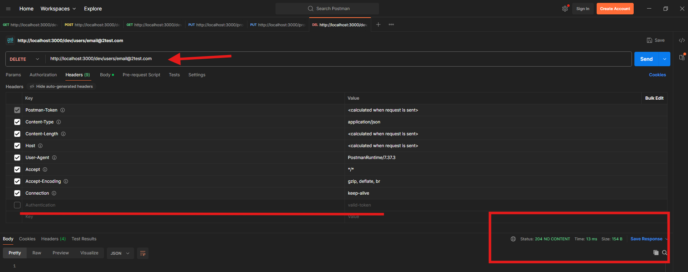

# Bug Report — User Management API

This document will be used as a list of all the defects (bugs) founds while the project is building and running the automated test suite against the document sdet_challenge_api.yml
Each bug represent cases where the API's behavior do not match as sdet_challenge_api.yml say.

## BUG-001 — POST /users returns 500 instead of 409 on duplicate email
When creating a user with an email that already exists, the API returns
`500 Internal Server Error` instead of the `409 Conflict` defined in the sdet_challenge_api.yml.

**Steps to reproduce:**
1- create a random user successfully or you can get one if there are users created.
2- get email created
3- Try to create a new user using the same email

**Expected:** `409 Conflict` with an `ErrorResponse` body.
**Actual:** `500 Internal Server Error` with `{"error": "Internal server error"}`.

**Evidence:** Automated test `test_valid_duplicate_email_user` + manual reproduction in Postman.

## BUG-002 — POST /users accept invalid email format
When creating a user with malformed email format, the API documentation say should be
rejected with `400 Validation error`. Instead, the API accepts an email without
an `@` symbol and creates the user, returning `201 Created`.

**Steps to reproduce:**
1- Send `POST /users` with body `{"name": "manuel test", "age": 4, "email": "email2test.com"}`.

**Expected:** `400 Validation error` with an `ErrorResponse` body.
**Actual:** `201 Created` user created with an invalid email.

**Evidence:** Automated test `test_create_user_invalid_return_400` + manual reproduction in Postman.

## BUG-003 — GET /users/{email} returns 500 instead of 404 according API documentation for non-existent users

According API documentation difne when endpoint `GET /users/{email}` is executed with an email that does not exist, 
should return `404 Not Found`with an `ErrorResponse` body. Instead, the API returns
`500 Internal Server Error`.

**Steps to reproduce:**
1- Send `GET /users/{email}` with email does not exist. (example. definitely_does_not_exist_12345@nowhere.com)

**Expected:** `404 Not Found` with an `ErrorResponse` body.
**Actual:** `500 Internal Server Error` with `{"error": "Internal server error"}`.

**Evidence:** Automated test `test_get_user_not_found` + manual reproduction in Postman.

## BUG-004 — DELETE /users/{email} does not enforce authentication in dev

**Severity:** High (security + contract violation)

According to the API documentation, `DELETE /users/{email}` requires an
`Authentication` header, and the spec states that dev and prod behave identically.
Using the documented token (`mysecrettoken`), the two environments behave differently:

- **prod:** Authentication is enforced correctly. A DELETE with the valid token
  succeeds (`204 No Content`), and a request with a missing or invalid token is
  rejected (`401 Unauthorized`).

- **dev:** Authentication is NOT enforced. The DELETE succeeds (`204 No Content`)
  with no token, an invalid token, or any header name (`Authentication` or
  `Authorization`). This is a security concern: a user can be deleted without
  valid credentials.
  **Evidence:** 

Prod matches the contract, but dev does not, so the two environments do not share
the "identical behavior" guaranteed by the specification.

**Steps to reproduce (dev):**
1. Create a user in dev.
2. Send `DELETE /dev/users/{email}` with no `Authentication` header.

**Expected:** `401 Unauthorized` (authentication is required per the contract).
**Actual:** `204 No Content` — the user is deleted without authentication.

